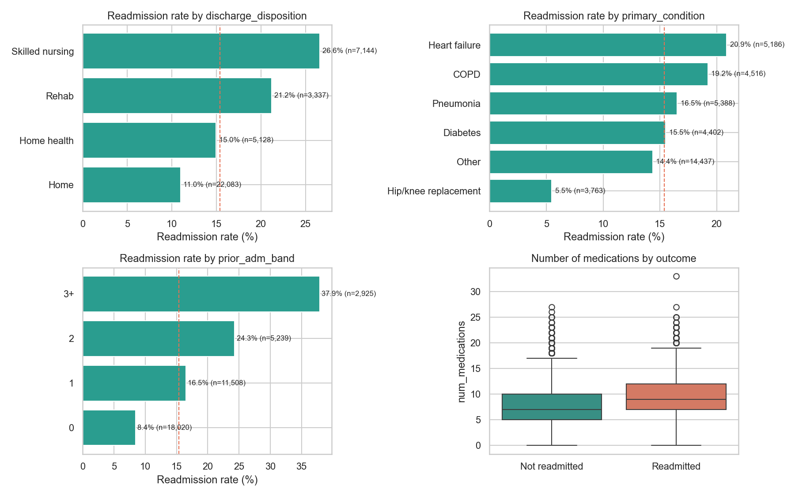
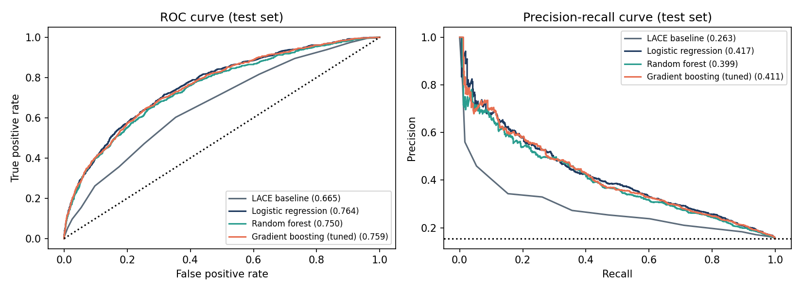
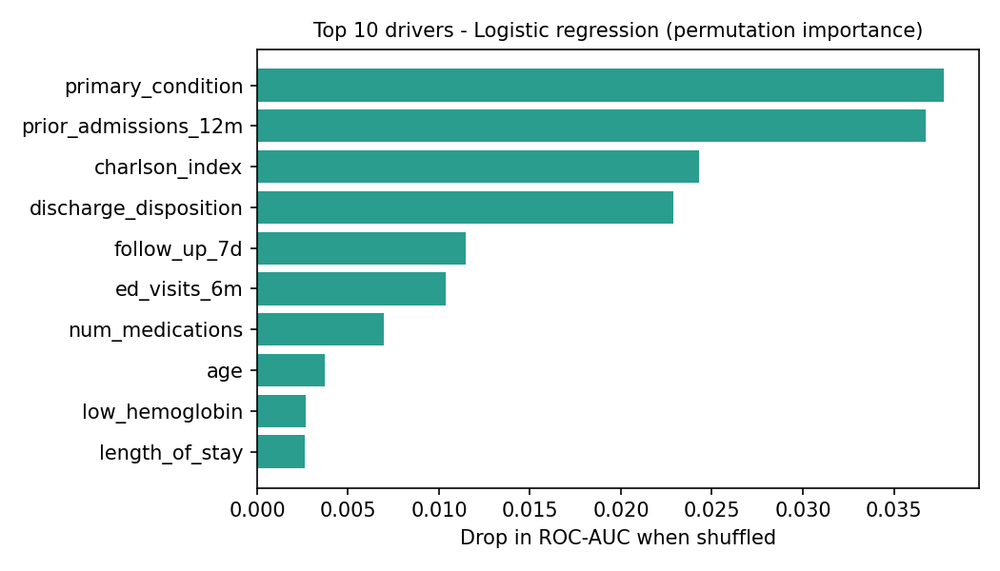

# Predicting 30-Day Hospital Readmission Risk

A Python data science project that predicts, on the day of discharge, which adult hospital patients are likely to have an unplanned readmission within 30 days. Care teams can use the scores to focus follow-up calls, early clinic visits and medication reviews on the patients who need them most.

Built during the **Virtual Data Science Explorer Internship (YuvaIntern)** by **V Chakradhar**.

> **Data note:** this project uses **synthetic data only**. `src/generate_data.py` creates realistic but fake hospital records, deliberately including real-world problems: missing lab values, outliers, duplicate rows and inconsistent labels. No real patient information is used anywhere.

---

## Internship reports

| Week | Report | Topic |
|---|---|---|
| 1 | [Project plan & strategy](reports/Week1_Project_Plan_Readmission.docx) | Problem, objectives, scope, methodology, 35-hour timeline, tools, risks |
| 2 | [EDA & visualisation framework](reports/Week2_EDA_Visualization_Framework.docx) | Data types, exploration techniques, chart strategy, reporting plan |
| 3 | [ML development & evaluation plan](reports/Week3_ML_Model_Development_Plan.docx) | Preprocessing, model selection, tuning, metrics, validation, deployment |
| 4 | [Final report & presentation plan](reports/Week4_Final_Report_Presentation_Plan.docx) | Executive summary, insights, recommendations, communicating to non-technical stakeholders |

The reports are planning documents, and their charts are labelled mock-ups. This repository **implements** that plan. The results below come from actually running the code.

---

## Repository structure

```
hospital-readmission-prediction/
├── src/
│   ├── generate_data.py     # synthetic EHR-style encounters (with realistic data-quality issues)
│   ├── clean.py             # validation, de-duplication, outlier capping, feature engineering, LACE score
│   ├── eda.py               # data-quality profile, univariate/bivariate/multivariate analysis, findings table
│   ├── train.py             # grouped CV, 4 models, tuning, test evaluation, calibration, importance, fairness
│   └── report_diagrams.py   # diagrams and mock-up charts used in the Word reports
├── outputs/
│   ├── figures/             # EDA and model evaluation charts
│   ├── eda_findings.csv     # findings log (finding, evidence, implication)
│   ├── metrics.json         # all CV and test metrics, selected model, fairness results
│   └── cleaning_log.json    # every cleaning step and rows affected
├── docs/diagrams/           # workflow diagrams from the reports
├── reports/                 # the four weekly internship reports (.docx)
├── run_pipeline.sh          # runs the whole pipeline end to end
└── requirements.txt
```

## How to run

Requires Python 3.9 or later.

```bash
git clone https://github.com/chakri192/hospital-readmission-prediction.git
cd hospital-readmission-prediction
python -m venv .venv && source .venv/bin/activate   # Windows: .venv\Scripts\activate
pip install -r requirements.txt
./run_pipeline.sh                                    # Windows: run the four python commands inside it
```

The full run takes about a minute on a laptop. Results are written to `outputs/`, and the trained model to `models/readmission_model.joblib`.

---

## Pipeline

```
generate_data ─► clean ─► eda ─► train
 37,752 rows     37,692    10 findings   LACE · Logistic regression · Random forest · Gradient boosting
```

**Cleaning** (from `outputs/cleaning_log.json`): 60 duplicate rows removed, 8 impossible ages fixed, 1,315 inconsistent sex labels standardised, 2,233 missing insurance values kept as "Unknown", and 375 extreme lengths of stay capped at the 99th percentile. Lab values are imputed *inside* the model pipeline to avoid leakage.

**Engineered features:** LACE score, polypharmacy flag (5+ drugs), abnormal sodium, low haemoglobin, HbA1c-tested indicator and winter discharge, alongside utilisation history (prior admissions, ED visits) and the Charlson comorbidity index.

**Validation design:**
- A 15% test set, split by patient so no patient appears in both training and test. It is scored only once, at the end.
- 5-fold `StratifiedGroupKFold` cross-validation on the remaining development set.
- All preprocessing sits inside scikit-learn `Pipeline`s, so nothing is learned from validation folds.
- Hyperparameters for gradient boosting are tuned with `RandomizedSearchCV`.
- **Model selection rule:** a complex model is chosen only if it beats logistic regression by at least 0.02 cross-validated ROC-AUC.

---

## Results

### Exploratory analysis (selected findings)

| Finding | Evidence |
|---|---|
| Prior admissions are the strongest signal | 8.4% readmitted with 0 prior admissions vs **37.9%** with 3 or more |
| Discharge destination matters | Skilled nursing **26.6%** vs home 11.0% (chi-square p < 0.001) |
| Condition-specific risk | Heart failure 20.9%, hip/knee replacement 5.5% |
| Early follow-up is associated with fewer readmissions | 12.9% with follow-up within 7 days vs 18.8% without (association, not proof of cause) |
| Target is imbalanced | 15.4% readmitted, so accuracy alone would be misleading |

Full table: [`outputs/eda_findings.csv`](outputs/eda_findings.csv)



### Model comparison

| Model | CV ROC-AUC | Test ROC-AUC | Test PR-AUC | Recall in top 20% | Precision in top 20% |
|---|---|---|---|---|---|
| LACE baseline (clinical checklist) | 0.648 | 0.665 | 0.263 | 35.6% | 27.3% |
| **Logistic regression (selected)** | **0.758 ± 0.003** | **0.764** | **0.417** | **49.8%** | **38.5%** |
| Random forest | 0.748 ± 0.004 | 0.750 | 0.399 | 47.5% | 36.8% |
| Gradient boosting (tuned) | 0.754 | 0.759 | 0.411 | 47.7% | 37.0% |

**Logistic regression was selected.** Tuned gradient boosting did not beat it in cross-validation (a difference of -0.004), so the selection rule keeps the simpler, more explainable model. Compared with the LACE checklist, the selected model:
- raises ROC-AUC from 0.665 to 0.764
- catches about **half of all readmissions in the top 20% of risk scores**, compared with about a third for LACE
- gives well-calibrated probabilities (Brier score 0.112)




### Main drivers (permutation importance)

Primary condition, prior admissions in the last 12 months, Charlson comorbidity index, discharge disposition, follow-up within 7 days, and ED visits.



### Fairness check

Recall at the top-20% threshold is similar for women (51%) and men (49%). It differs a lot by **age band** (36% for ages 40-64 vs 66% for 75+) and by **insurance** (24% self-pay vs 59% Medicare), well beyond the 10-point target set in the plan. This is flagged as a limitation. Possible fixes are group-aware thresholds or extra features for younger patients, to be validated before any real use.

---

## Limitations and next steps

- The data is synthetic, so the absolute numbers show the method working, not real clinical performance.
- Further steps: SHAP explanations for each patient, probability calibration checks per group, temporal validation, a Streamlit dashboard, and a FastAPI scoring endpoint with drift monitoring (see the Week 3 report).

## Tech stack

Python · pandas · NumPy · scikit-learn · SciPy · matplotlib · seaborn · pyarrow · joblib

## License

MIT. See [LICENSE](LICENSE).
