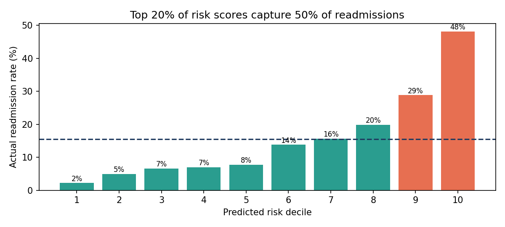

# Predicting 30-Day Hospital Readmission Risk

Predicts which hospital patients are likely to be readmitted within 30 days of going home, using information available on the day of discharge. Care teams can use the risk scores to decide who gets follow-up calls, early clinic visits, or a medication review first.

Built during the **Virtual Data Science Explorer Internship (YuvaIntern)** by **V Chakradhar**.

> **Synthetic data only.** `src/generate_data.py` creates fake hospital records with the kinds of problems real data has: missing lab results, outliers, duplicate rows, and inconsistent labels. No real patient information is used.

## Results

The selected model ranks patients so that **the top 20% highest-risk patients include about half of all readmissions**, compared with about a third for LACE, a standard hospital readmission checklist.

| Model | Test ROC-AUC | Test PR-AUC | Readmissions caught in top 20% |
|---|---|---|---|
| LACE checklist (baseline) | 0.665 | 0.263 | 35.6% |
| **Logistic regression (selected)** | **0.764** | **0.417** | **49.8%** |
| Random forest | 0.750 | 0.399 | 47.5% |
| Gradient boosting (tuned) | 0.759 | 0.411 | 47.7% |

Logistic regression was chosen because the more complex models didn't beat it by a meaningful margin, and it's easier to explain to clinicians.



**Strongest predictors:** primary condition, admissions in the last 12 months, comorbidity score (Charlson index), where the patient went after discharge, whether they had a follow-up within 7 days, and recent emergency visits.

**Key patterns in the data:**

- 8.4% of patients with no prior admissions were readmitted, against 37.9% with 3 or more.
- Patients discharged to a skilled nursing facility were readmitted at 26.6%, against 11.0% for those going home.
- Heart failure had the highest readmission rate (20.9%); hip and knee replacement the lowest (5.5%).
- A follow-up within 7 days went with fewer readmissions (12.9% vs 18.8%). That's an association, not proof it causes the drop.

All findings: [`outputs/eda_findings.csv`](outputs/eda_findings.csv). All metrics: [`outputs/metrics.json`](outputs/metrics.json).

### Fairness

The model catches readmissions at a similar rate for women (51%) and men (49%), but not across age groups (36% for ages 40–64 vs 66% for 75+) or insurance types (24% for self-pay vs 59% for Medicare). That gap would need fixing before any real use, for example with group-specific thresholds or more features for younger patients.

## Setup

Needs **Python 3.12 or 3.13**. The package versions are pinned so the results above reproduce exactly, and they aren't available for other Python versions.

```bash
git clone https://github.com/chakri192/hospital-readmission-prediction.git
cd hospital-readmission-prediction
python3.12 -m venv .venv
source .venv/bin/activate          # Windows: .venv\Scripts\activate
pip install -r requirements.txt
```

## Run

```bash
./run_pipeline.sh
```

This takes about a minute. It runs four steps, which you can also run on their own:

| Step | Command | Output |
|---|---|---|
| 1. Generate data | `python src/generate_data.py --patients 20000 --out data/raw/encounters.csv` | 37,752 hospital stays for 20,000 patients |
| 2. Clean | `python src/clean.py --raw data/raw/encounters.csv --out data/processed/encounters_clean.parquet` | 37,692 cleaned stays and `outputs/cleaning_log.json` |
| 3. Explore | `python src/eda.py --data data/processed/encounters_clean.parquet` | Charts in `outputs/figures/` and `outputs/eda_findings.csv` |
| 4. Train | `python src/train.py --data data/processed/encounters_clean.parquet` | `outputs/metrics.json`, more charts, and the model in `models/readmission_model.joblib` |

Use `--patients` and `--seed` in step 1 to generate a different dataset.

### What cleaning does

- Removes 60 duplicate rows
- Fixes 8 impossible ages
- Standardises 1,315 inconsistent sex labels (`Female`, `female`, `F` → `F`)
- Keeps 2,233 missing insurance values as "Unknown"
- Caps 375 extreme lengths of stay at the 99th percentile (22.3 days)
- Adds features: LACE score, taking 5+ medications, abnormal sodium, low haemoglobin, HbA1c tested, and winter discharge

### How models are tested

- About 14% of stays (5,438) are held back as a test set and used only once, at the end. No patient appears in both training and test data.
- Models are compared with 5-fold cross-validation on the rest.
- Missing lab values are filled in during training only, so test data never influences the model.

## Scoring patients

After running the pipeline, load the model and score cleaned records (from the project folder):

```python
import joblib
import pandas as pd
from src.clean import CATEGORICAL_FEATURES, NUMERIC_FEATURES

model = joblib.load("models/readmission_model.joblib")
patients = pd.read_parquet("data/processed/encounters_clean.parquet").head(5)
patients["risk"] = model.predict_proba(patients[NUMERIC_FEATURES + CATEGORICAL_FEATURES])[:, 1]
print(patients[["encounter_id", "risk"]])
```

`risk` is the predicted probability of readmission within 30 days.

## Internship reports

| Week | Report | Covers |
|---|---|---|
| 1 | [Project plan](reports/Week1_Project_Plan_Readmission.docx) | Problem, goals, scope, method, timeline, risks |
| 2 | [EDA and visualisation](reports/Week2_EDA_Visualization_Framework.docx) | Data types, exploration methods, chart choices |
| 3 | [Model development plan](reports/Week3_ML_Model_Development_Plan.docx) | Preprocessing, model choice, tuning, evaluation, deployment |
| 4 | [Final report and presentation](reports/Week4_Final_Report_Presentation_Plan.docx) | Summary, insights, recommendations |

The reports are planning documents; their charts are illustrative mock-ups. The code in this repository carries out that plan, and the results above come from running it. To regenerate the report diagrams in `docs/diagrams/`:

```bash
python src/report_diagrams.py
```

## Project structure

```
src/
  generate_data.py     Creates the synthetic hospital data
  clean.py             Cleaning and feature engineering
  eda.py               Charts and findings
  train.py             Model training, evaluation, fairness check
  report_diagrams.py   Diagrams for the weekly reports
outputs/               Results from the last run: figures, findings, metrics, cleaning log
docs/diagrams/         Report diagrams
reports/               The four weekly reports (.docx)
run_pipeline.sh        Runs everything
```

`data/` and `models/` are created when you run the pipeline and aren't stored in the repository.

## Limitations

- The data is synthetic, so the numbers show the method working, not real clinical accuracy.
- The fairness gaps above would need to be closed before real use.
- Possible next steps: explanations for each patient's score (SHAP), checking predictions over time, and a dashboard or scoring API.

## License

MIT. See [LICENSE](LICENSE).
